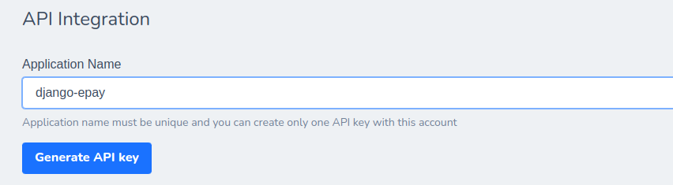
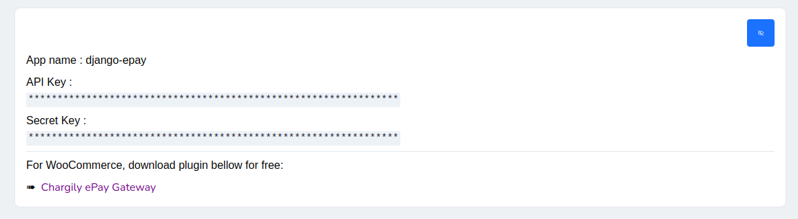

# Quickstart
First of all you need to have account in [charigly](https://epay.chargily.com.dz).

- create an ePay Merchant account By clicking [here](https://epay.chargily.com.dz/register) 

- After you complete registration you need to create Application Follow this [link](https://epay.chargily.com.dz/secure/admin/epay-api)
    

- After creating new Application , You will get API KEY and SECRET KEY For integration, you click on the right button to show hidden fields
    

## Example
First we create a variable to store our `API KEY`
```py
API_KEY = "api_yOdfdsawe5re5wDrvFF2f4dafAqxxX7FRii1dgXfRd8ectfI4IaTpFbHxdAUeu2IdB"
```

<br>
Now we need to create `Invoice` for payment  
lests start by importing `invoice` module and use `Invoice` class
```py
from chargily_lib.constant import EDAHABIA
from chargily_lib.invoice import Invoice

API_KEY = "api_yOdfdsawe5re5wDrvFF2f4dafAqxxX7FRii1dgXfRd8ectfI4IaTpFbHxdAUeu2IdB"


invoice = Invoice()
invoice.client = "Tarek berkane"
invoice.client_email = 'example@gmail.com'
invoice.invoice_number = '1'
invoice.mode = EDAHABIA
invoice.amount = 10000 
invoice.discount = 0
invoice.comment = 'my first invoice payment.'
invoice.back_url = 'https://example.com/'
invoice.webhook_url = 'https://example.com/'
```

and now we need to send request to chargily website 
we import `make_payment`  function in module `sync_lib` to send a request.
Then we convert `response` data to python dict using `json` 


```py
import json


from chargily_lib.constant import EDAHABIA
from chargily_lib.invoice import Invoice
from chargily_lib.sync_lib.webhook import make_payment

API_KEY = "api_yOdfdsawe5re5wDrvFF2f4dafAqxxX7FRii1dgXfRd8ectfI4IaTpFbHxdAUeu2IdB"


invoice = Invoice()
invoice.client = "Tarek berkane"
invoice.client_email = 'example@gmail.com'
invoice.invoice_number = '1'
invoice.mode = EDAHABIA
invoice.amount = 10000 
invoice.discount = 0
invoice.comment = 'my first invoice payment.'
invoice.back_url = 'https://example.com/'
invoice.webhook_url = 'https://example.com/'


response = make_payment(invoice, API_KEY)

if response.status_code == 201:
    data = json.dumps(response.content)
    print(data['checkout_url'])
```

the result will be an url to the payment 
```sh
https://epay.chargily.com.dz/checkout/<random-text>
```